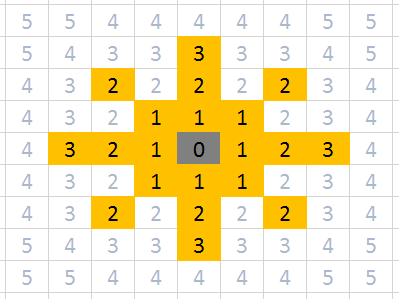
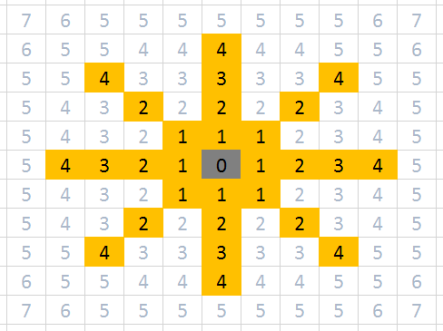

# The Game

The Game for Entelect Challenge 2019 is **Worms**. 

In a match **2** players with **3** worms each will play against each other. The goal is to be the last player with any conscious worms left.

## Contents
* [The Map](#the-map) 
* [The Commands](#the-commands) 
* [Command Order](#command-order) 
* [Scores](#scores) 

## The Map

The game is played on a grid of **32x32** cells. Every cell is one of the following types:
* Air - worms can move into and shoot through air cells
* Dirt - worms cannot move into or shoot through dirt cells, it has be dug out first
* Deep Space - worms cannot interact with deep space cells

Cells can contain powerups. Powerups are picked up when a worm moves onto a cell. 
* A Healthpack will immediately restore **20** health to the worm who picks it up. 

Every cell has a coordinate in the form `X,Y` starting from `0,0` in the top left corner and increasing downwards and to the right. 

Two map files will be a available: A json file `state.json` and a text file `state.txt`. In addition the map will be rendered on the console during a running game. 

State files are explained in detail [here](state-files.md "Detailed explanation of the state files").

## The commands

In every round each player can submit one command for their active worm. The active worm will be determined by the game engine and will be indicated in the map files as described above. 

All player commands are validated before executing any commands. Invalid commands (eg. Invalid syntax, moving to an occupied cell) result in the worm doing nothing. 

### Move
The format of the move command is `move x y`

* `x y` is the coordinate of the cell the worm is moving to
* Worms can move to any adjacent air cells (including diagonally)
* Worms cannot move to cells occupied by another worm
* Worms cannot move to dirt or deep space cells
* If two worms move to same cell in the same turn:
    * Both worms will take damage
    * Worms will either swap places or stay in their current positions (with an equal probability)

### Dig
The format of the dig command is `dig x y`

* `x y` is the coordinate of the cell the worm is digging out
* Worms can dig any adjacent dirt cells (including diagonally)
* Digging a dirt cells will change its type to air
* Two worms digging the same cell in the same turn is a valid move 

### Shoot
The format of the shoot command is `shoot {direction}`

* `{direction}` can be any of the eight principal directions: N (North), NE (North-East), E (East), SE (South-East), S (South), SW (South-West), W (West), NW (North-West)

* Shooting distance is measured in [euclidean distance](https://en.wikipedia.org/wiki/Euclidean_distance). To determine if a cell is in range, calculate its euclidean distance from the worm's position, round it downwards to the nearest integer (floor), and check if it is less than or equal to the max range

* Shots are blocked by dirt and deep space cells
* The first worm in range in the shooting direction will lose health equal to the weapon's damage
* When a worm's health is 0 or lower, it will fall unconscious and be removed from the map 
* Be careful! Friendly fire could hit your own worms

The two diagrams below illustrates how a worm can shoot with a maximum range of 3 and 4 respectively:

### Do Nothing
The`nothing` command can be used when a Player does not want to do anything. Any invalid commands will also be considered as doing nothing. 

If a player does nothing for **10** consecutive turns, their bot will be considered invalid and they will be disqualified from the match.

## Command Order

All commands submitted in a round will be evaluated in the following order:
1. Movement
2. Digging
3. Shooting

This implies the following regarding command interaction:
* A worm cannot move into a cell that another worm is digging open in this round
* A worm can dig open a path for another worm's shot
* A worm can move into range of another worm's shot
* A worm can move out of range of another worm's shot 
* Two worms can dig open the same dirt cell in a single round

## Scores

Player scores will only be considered in the case of a tie:
* The maximum amount of rounds (**400**) have passed and there is more than one player left
* If both players lost their last worm in the same round 

The total score value is determined by adding together the player's average worm health and the points for every single command the they played: 
*  Attack:
    * Shooting any worm unconscious gives **10** points
    * Shooting an enemy worm gives **6** points
    * Shooting one of your own worms gives **3** points
    * A missed attack gives **1** points  
* Moving gives **2** point
* Digging gives **4** points
* Doing nothing gives **0** points
* An invalid command makes the player **lose 1** point
